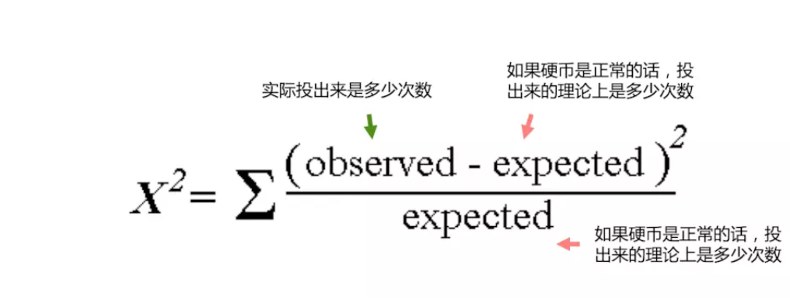

# 统计学

# 统计学

统计学用来干嘛？

## 描述统计学（均值，标准差，中位数）

描述统计学作用是从总体数据中提取变量的主要信息，从而从总体层面上，对数进行统计描述，通常会配合统计图来进行辅助

描述性统计所提取的统计信息—-统计量

- 频数与频率

  频数直方图（单变量）

  - 频数
  - 频率

- 集中性趋势

  - 均值（分布均匀的时候可以使用均值，非左偏或者右偏）
  - 中位数（左偏或者右偏的时候使用中位数比较好）
  - 众数（离散型变量的填充可以使用众数，Mode）
  - 分位数（百分位，四分卫<四分位中的q1到q3之间的一般>，中位数）
    - 四分位点求法，index从0开始，n为数组中元素个数len(lists)列表长度
      - Q1_index = (n-1)*0.25
      - Q2_index = (n-1)*0.5 # 也是中位数点
      - Q3_index = (n-1)*0.75
    - 奇数情况和偶数情况也要会判断求出中间位置的值
      - 奇数：类似与12345 中间一个数
      - 偶数：类似于123456 （3+4）/2 = 3.5这样
      - 也可以直接通过pandas. df.describe().loc[“25%”]来取

- 离散程度分析

  - 极差（最大数值-最小值的距离，一般不用这个来作为比较）
  - 方差（离散程度的度量，但是因为计算平均距离的时候带上了平方，所以量纲不同了,每个元素与均值偏离的大小）越小越稳定
  - 标准差（方差开方，把量纲变为去）越小越稳定

- 分布形状

  - 偏度

    - 偏度（偏度为0，如正态分布）（众数=均值=中位数）三阶标准化矩 df.skew()

    - 左偏（长尾在左就是左偏,都是众数比均值大，下面同理）（均值>中位数>众数）偏度小于0

    - 右偏（反过来，均值<中位数<众数)，偏度大于0

    - 如何快速判断是属于左偏还是右偏

      - 直接对比数字（左偏是众数大，右偏是均值大，中位数永远中间）

      - 绘制图案，用上面的方法，下图这种叫做**密度分布曲线**（密度函数，并且把直方图给去掉了，可以用直方图连接中点来绘制出来）。

        在[频率分布直方图](https://baike.baidu.com/item/%E9%A2%91%E7%8E%87%E5%88%86%E5%B8%83%E7%9B%B4%E6%96%B9%E5%9B%BE/7436692)中，当样本容量充分放大时，图中的组距就会充分缩短，这时图中的阶梯折线就会演变成一条光滑的曲线，这条曲线就称为总体的密度分布曲线。这条曲线排除了由于取样不同和测量不准所带来的误差，能够精确地反映总体的分布规律。

偏度

- 峰度峰度是和标准正太分布来进行对比的。标准正太分布，峰度为0,（低矮）**标准正态分布：偏度，峰度都为0，均值和标准差都是1**如果峰度大于0，那么峰度高于标准正态分布（数据在分布上比标准密集，方差小（纵向的宽和方差相关）pandas 中相关函数，很难计算复杂的，df.kurt()

## 推断统计学（抽样，置信区间，假设检验）

推断统计是研究如何利用样本数据来推断总体特征的统计方法。比如，要了解一个地区的人口特征，不可能对每个人的特征一一进行测量，对产品的质量进行检验，往往是破坏性的，也不可能对每个产品进行测量。这就需要抽取部分个体即样本进行测量，然后根据获得的样本数据对所研究的总体特征进行推断，这就是推断统计要解决的问题。

- 总体个体与样本

  - 总体 有调查的总体
  - 个体 总体中某个数据
  - 样本 样本是总体的一个子集，样本中个体数量叫做样本容量
  - 描述*总体*特性的指标称为*总体参数*，简称*参数*

- 点估计与区间估计

  - 点估计： 使用样本的**统计量**取代替总体的参数（描述统计学的）
    - 打个比方：抽了一次样本，然后求出了样本的平均值，想以此来当成总体的均值，**当然有误差**  所以才需要继续优化估算的准确性，然后才有下面的区间估计
  - 区间估计 ：区间估计（interval estimate）是在点估计的基础上，**点估计增加准确性**，给出总体参数估计的一个区间范围，该区间通常由样本统计量加减估计误差得到。与点估计不同，进行区间估计时，根据样本统计量的抽样分布可以对样本统计量与总体参数的接近程度给出一个概率度量。
  - 这两个算是互补的吧，一个可以有一个值，另一个给出一个范围。

- 💥重要，中心极限定理

  - 内容：中心极限定理，是指概率论中讨论随机变量序列部分和分布渐近于正态分布的一类定理。这组定理是数理统计学和误差分析的理论基础，指出了大量随机变量近似服从正态分布的条件。
  - 要注意的前提：
    - **总体本身的分布不要求正态分布** 上面的例子中，人的体重是正态分布的。但如果我们的例子是掷一个骰子（平均分布），最后每组的平均值也会组成一个正态分布。（神奇！）
      - 样本均值构成正态分布，其均值等于**总体均值μ**
      - 样本均值构成正态分布，其标准差等于**总体标准差σ/根号n**
    - **样本每组要足够大，但也不需要太大** 取样本的时候，一般认为，每组大于等于30个，即可让中心极限定理发挥作用。
    - **简化总结：总体不一定是正态分布，但是只要样本数量（一般大于30）这样，多次取样，最终样本的分布会是正态分布。可以使用这个定理来进一个利用样本的统计量来对总体的统计量做更好的估计！**

- 正态分布的特点

  - 以均值为中心，在1倍标准差内，包含约68%的样本数据（μ-σ，μ+σ）
  - 以均值为中心，在2倍标准差内，包含约95%的样本数据（μ-2σ，μ+2σ）
  - 以均值为中心，在3倍标准差内，包含约99.7%的样本数据（μ-3σ，μ+3σ）

- 假设检验

  - 原假设H0，备择假设H1，一般是我们想要拒绝的假设
    - 比如我们如果想要推断这个食物是否有毒，那么原假设应该设置成假设这个有毒，如果条件不足够推翻原假设，那么就维持原假设。原假设的设置一般为：等于=、大于等于>=、小于等于<=
    - 备则假设是统计者想要接受的假设。备择假设的设置一般为：不等于、大于>、小于<。
    - 为什么统计者想要拒绝的假设放在原假设呢？因为原假设备被拒绝如果出错的话，只能犯第I类错误，而犯第I类错误的概率已经被规定的显著性水平所控制。有点看不懂哈？没关系我们讲一下假设检验中的两种错误和显著性水平就清楚了。（https://zhuanlan.zhihu.com/p/86178674）
  - 假设检验的步骤
    - 设置原假设和备择假设，然后假设原假设H0为真
    - 设置显著性水平
      - α意思就是犯一类错误的概率，
        - 一类错误就是原假设为真，但是判断为假，出的错，就是，丢真错误！的概率
    - 根据问题选择假设检验的方式
    - 计算统计量，并通过统计量获取p值
    - 根据p值与σ值进行比较
      - p＞σ 时候接受原假设为真
      - p< σ 时候拒绝原假设为真

- **显著性水平**和P-value

  - 显著性水平是指当原假设实际上正确时，检验统计量落在拒绝域的概率，简单理解就是犯弃真错误的概率。这个值是我们做假设检验之前统计者根据业务情况定好的。显著性水平α越小，犯第I类错误的概率自然越小，一般取值：0.01、0.05、0.1等

    当给定了检验的显著水平α=0.05时，进行双侧检验的Z值为1.96（临界值），t值为 。

    当给定了检验的显著水平α=0.01时，进行双侧检验的Z值为2.58 。

    当给定了检验的显著水平α=0.05时，进行单侧检验的Z值为1.645 。

    当给定了检验的显著水平α=0.01时，进行单侧检验的Z值为2.33

  - p值（样本总数与总体无差异的概率）

    - 概念：假定原假设为真时，得到与样本相同或者更极端结果的概率。
    - 所以p值如何求？
      - 比如：比如要求的样本符合Z分布，所以就会有Z = blabla... 然后求出来了后就查表 得到p的概率值。然后更多的是<b>记住常见的临界值，比如正态分布,95%,α=5%这种，直接知道端是±1.96，所以只要Z大于1.96那就说明在接受域外也就是到了拒绝域</b>拒绝原假设H0
        - 接受域，拒绝域这个是对分布上的Z，t或者是别的统计量而言的，也就是说这个是不用p的时候直接看图判断用的。
        - 如果看p那就要求出这个概率p，查表看看和给定的显著性水平之间的概率大小比，如果p大于显著性水平α那就说明 ，犯一类错误的概率确实大于
      - p值就是这样求的，那怎么用？当p值<α的时候就说明原假设H0推翻，
      - 如果p>α的时候那就维持原假设。(通常α取值0.05显著性水平0.05时候是有百分之99.5的可能性)
      - **无论如何**都是p>α，单侧检验都是；双侧检验则是

- 总体均值估计（都是用样本和总体的参数均值进行估计的）

  - 总体方差已知，样本数量足够多（大于30）
    - Z检验（方差已知，样本数量大于30，总体服从正态分布的假设。
    - 如果方差不可知，那就用样本方差作为总体方差
  - 💥总体方差未知，样本数量大（总体要服从对称的T分布）
    - 都可以用T，因为其实总体的均值其实是不容易知道的。
    - 💥总体方差未知，样本数量小（
      - T检验，与Z类似，受自由度的影响

- 检验方式

  - 单侧检验（备择假设带有特定的方向性 形式为">""<"的假设检验，称为单侧检验 "<"称为左侧检验 ">"称为右侧检验
    - 左侧检验
    - 右侧检验
  - 双侧检验（备择假设没有特定的方向性，形式为“≠”这种检验假设称为双侧检验
- 假设检验中的两类错误
    - 1类错误（ α，弃真错误，就是原假设错误的概率，一类错误。
    - 2类错误（β，取伪错误，就是原假设是假
  
- 检验类型

  - 自由度的意思，就是T检验和卡方检验中需要用到n-1(n是样本容量，不是抽样次数，一次抽样<b>随机</b>)

  - 参数检验

    - z检验（u检验）样本较大，或者都行，

    - t检验（一般可以代替z检验，因为一般不知道总体的方差）例如n<30

      参考https://baijiahao.baidu.com/s?id=1636037420591254317&wfr=spider&for=pc

      https://www.biomart.cn/experiment/793/2714023.htm   丁香园，三种进行区分

      - 一个总体
        - **单样本t检验**
        - 两个样本，但是是一个总体（类似对照组）
          - **独立样本T检验**用于分析定类数据（X）与定量数据（Y）之间的差异情况。如果X、Y均为定类数据，则使用卡方分析
            - 独立样本T检验除了需要服从正态分布、还要求两组样本的**总体方差相等**。当数据不服从正态分布或方差不齐时，则考虑使用**非参数检验**。
      - 双总体T检验（检验两个独立样本所代表的总体均值差异是否显著）
        - **配对**样本t检验
          - 配对样本T检验用于分析配对定量数据之间的差异对比关系。与独立样本t检验相比，配对样本T检验要求样本是配对的。两个样本的样本量要相同；样本先后的顺序是一一对应的。

    - F检验

      - **F检验**又叫**方差齐性检验**，目的是判断两个样本的总体方差是否相等，计算**双总体样本检验**的前提条件。过程有点麻烦，涉及重点词汇：**全部观测的均值**x均值hat（不是总体均值），**组均**值，**总平方和SST**，**组间因素平方和SSTR**,**组间因素平均平方和MSTR**，**组内残差平方和SSE**，**残差平均平方和MSE**，最后才是**计算F检验量**,然后通过F检验量对假设检验和备择假设做出决策，F=MSTR/MSE  ~ F(k-1，n-k) ,k是组数，n是所有观察值的个数
      - 单因素方差分析
      - 双因素方差分析

  - 非参数检验

    - **卡方检验**（X²检验)通常用在某个变量(或特征)值是不是和因变量有显著关系。检验在接受域那就是有显著关系，如果在拒绝域那就没有显。著关系，和前面的是一样处理的，当成一个工具即可。
    - 
    - https://blog.csdn.net/snowdroptulip/article/details/78770088 卡方检验
    - https://blog.csdn.net/weixin_39631030/article/details/82937368 卡方检验
    - 

- 平时检验的大概流程：

  - 先看是不是参数检验，如均值μ等。 

## 概率（独立事件，相关事件，期望，包括贝叶斯）详看概率论

## 概率分布（离散概率分布，连续概率分布）

## 机器学习（建模，加分项）

### 涉及模型详情看  [涉及模型.md](涉及模型.md)

- 分类算法
- 回归算法
- 聚类算法

需要掌握的核心技能：

- 特征工程
- 模型评估
- 交叉检验（用已有的数据检测算法的预测力）

sklearn